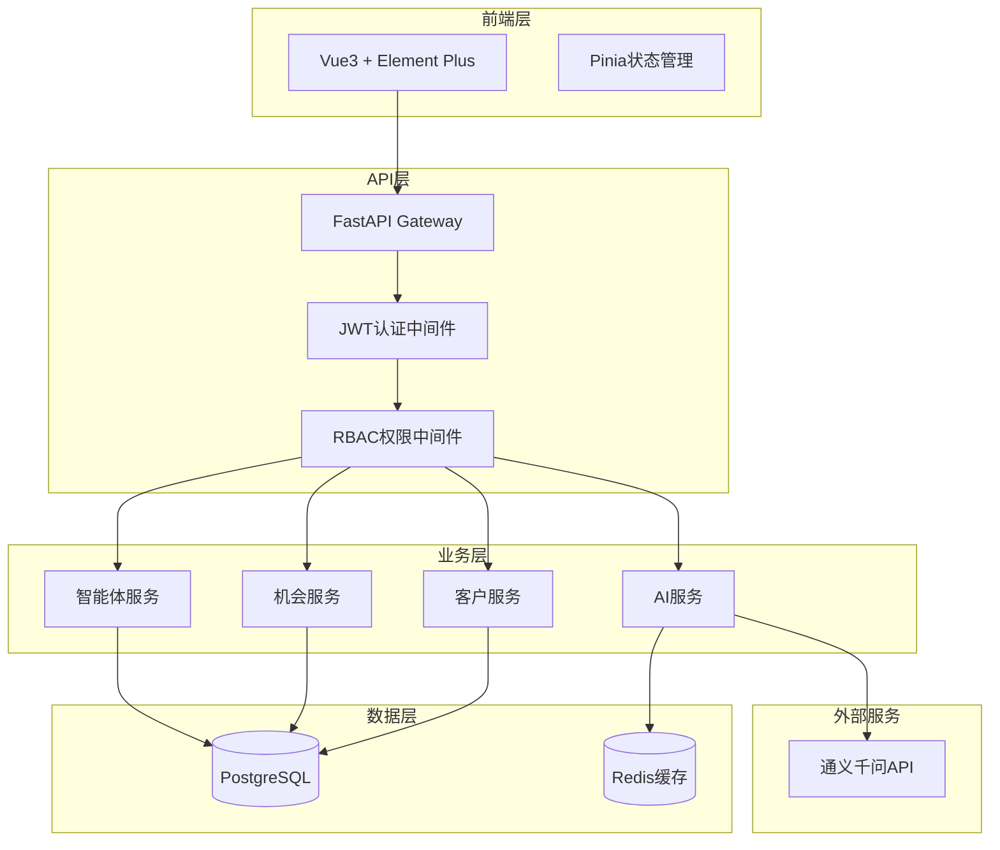

## 产品概述

AI销售助手系统优化改造，目标是将现有系统升级为企业级可生产部署版本。

## 核心功能

### 短期目标（必做）✅ 已完成

1. **安全性加固**：修复SECRET_KEY硬编码、CORS配置宽松问题，实现环境变量强制配置
2. **数据库迁移**：从SQLite迁移到PostgreSQL，保留现有数据，支持高并发
3. **用户系统完善**：实现完整RBAC权限系统，支持角色管理、团队管理、数据隔离

### 中期目标（核心）✅ 已完成

4. **AI服务优化**：添加重试机制、降级策略、Token监控、响应缓存
5. **智能体学习**：实现决策成功率统计、反馈驱动权重调整、A/B测试框架
6. **性能监控**：添加监控端点、完善日志系统、性能指标收集、错误追踪

### 长期目标（扩展）

7. **数据源扩展**：对接外部系统，实现数据自动同步
8. **移动端支持**：小程序/APP端适配
9. **高级分析**：BI报表、数据可视化大屏

---

## 数据源扩展规划

### 7.1 CRM系统对接

**支持平台**：
- 纷享销客
- 销售易
- Salesforce
- Zoho CRM

**对接方式**：
```
┌─────────────┐     API/Webhook      ┌─────────────┐
│  外部CRM    │ ──────────────────→  │  AI销售助手  │
│  系统       │                       │  数据同步    │
└─────────────┘                       └─────────────┘
```

**同步内容**：
- 客户信息双向同步
- 销售机会状态同步
- 跟进记录同步

### 7.2 企业通讯工具集成

**支持平台**：
- 企业微信
- 钉钉
- 飞书

**功能**：
- 消息通知推送
- 客户线索自动录入
- 审批流程对接

### 7.3 营销表单对接

**支持平台**：
- 腾讯问卷
- 金数据
- Typeform
- 自定义表单

**实现方式**：
```python
# Webhook回调接口
POST /api/webhooks/form/{source}
{
    "name": "客户姓名",
    "phone": "联系电话",
    "company": "公司名称",
    "source": "来源渠道"
}
```

### 7.4 网站行为数据

**数据采集**：
- 访客浏览轨迹
- 产品查看记录
- 表单填写行为
- 在线咨询记录

**技术方案**：
```
网站埋点 → 数据管道 → 数据清洗 → 入库分析
```

### 7.5 ERP系统对接

**对接内容**：
- 订单数据同步
- 库存信息查询
- 发票管理
- 客户信用额度

---

## 移动端支持规划

### 小程序端

**技术选型**：
- 微信小程序（原生/Taro/UniApp）
- 企业微信小程序

**核心功能**：
- 客户快速查看
- 跟进记录录入
- 消息推送接收
- 仪表盘查看

### APP端

**技术选型**：
- Flutter（跨平台）
- React Native
- 原生开发

---

## 高级分析规划

### BI报表

- 自定义报表生成器
- 多维度数据透视
- 数据导出（Excel/PDF）

### 可视化大屏

- 销售实时数据大屏
- 团队业绩排行榜
- 客户分布地图

---

## 已完成功能清单

| 功能模块 | 状态 | 说明 |
|---------|:----:|------|
| 测试覆盖 | ✅ | 单元测试+集成测试 |
| 文档完善 | ✅ | API文档、部署文档、用户手册 |
| CI/CD | ✅ | GitHub Actions自动化部署 |
| 性能优化 | ✅ | 二级缓存、数据库索引 |
| 安全加固 | ✅ | JWT认证、环境变量 |
| RBAC权限 | ✅ | 5角色、数据隔离 |
| PostgreSQL | ✅ | 连接池、Alembic迁移 |
| AI服务优化 | ✅ | 重试、降级、缓存 |
| 智能体学习 | ✅ | 决策优化、A/B测试 |
| 性能监控 | ✅ | 日志、指标、追踪 |

---

## 待开发功能清单

| 功能模块 | 优先级 | 预计工期 |
|---------|:------:|---------|
| CRM对接 | P1 | 2周 |
| 企业微信集成 | P1 | 1周 |
| 表单Webhook | P2 | 3天 |
| 网站埋点 | P2 | 1周 |
| ERP对接 | P3 | 2周 |
| 小程序端 | P2 | 3周 |
| BI报表 | P3 | 2周 |
| 数据大屏 | P3 | 1周 |

## 技术栈选择

### 后端技术

- **Web框架**：FastAPI（现有）
- **ORM**：SQLAlchemy 2.0（现有）
- **数据库**：PostgreSQL + asyncpg（替换SQLite）
- **认证**：JWT + python-jose + passlib[bcrypt]（现有依赖）
- **缓存**：Redis（新增）
- **数据库迁移**：Alembic（新增）
- **监控**：Prometheus + 结构化日志（新增）

### 前端技术

- **框架**：Vue 3 + TypeScript（现有JavaScript，逐步迁移）
- **状态管理**：Pinia（现有）
- **UI组件库**：Element Plus（现有）
- **路由**：Vue Router 4（现有）

## 实施方案

### 1. 安全性加固方案

**问题分析**：

- `config.py` 中 SECRET_KEY 使用硬编码默认值 "your-secret-key-here"
- `main.py` 中 CORS 配置为 `allow_origins=["*"]`
- 无用户认证系统

**解决方案**：

```
backend/app/core/config.py:
- SECRET_KEY: str = Field(..., env="SECRET_KEY")  # 无默认值，强制环境变量
- ALLOWED_ORIGINS: List[str] = Field(default=["http://localhost:5173"], env="ALLOWED_ORIGINS")

backend/.env.example:
- 创建环境变量模板，列出所有必需配置

backend/app/main.py:
- CORS使用 settings.ALLOWED_ORIGINS
```

### 2. 数据库迁移方案

**迁移策略**：

```
Phase 1: 添加PostgreSQL支持
- 添加 asyncpg 依赖
- 修改 database.py 支持 PostgreSQL 连接池
- 配置 Alembic 迁移工具

Phase 2: 数据迁移
- 创建 SQLite → PostgreSQL 迁移脚本
- 迁移所有现有数据（Customer, Opportunity, Quote, FollowUp, Agent相关表）

Phase 3: 切换验证
- 并行运行测试
- 数据一致性校验
```

**连接池配置**：

```python
engine = create_async_engine(
    DATABASE_URL,
    pool_size=20,
    max_overflow=10,
    pool_pre_ping=True,
    echo=False
)
```

### 3. RBAC权限系统方案

**数据模型设计**：

```
Organization (组织/租户)
├── Team (团队)
│   └── User (用户)
│       └── Role (角色)
│           └── Permission (权限)

User: id, username, email, password_hash, role_id, team_id, organization_id
Role: id, name, code, permissions(JSON)
Team: id, name, organization_id
Organization: id, name, plan, settings
Permission: resource + action (customer:read, customer:write, etc.)
AuditLog: 记录所有关键操作
```

**权限检查流程**：

```
请求 → JWT验证 → 解析用户 → 检查角色权限 → 数据隔离过滤 → 执行操作
```

**数据隔离策略**：

- 每个模型添加 `organization_id` 字段
- 查询时自动过滤当前用户的组织数据
- 管理员可查看团队数据，超管可查看组织数据

### 4. AI服务优化方案

**重试机制**：

```python
from tenacity import retry, stop_after_attempt, wait_exponential

@retry(stop=stop_after_attempt(3), wait=wait_exponential(multiplier=1, min=2, max=10))
async def chat(self, prompt: str):
    ...
```

**降级策略**：

```
AI调用失败 → 规则引擎降级 → 缓存历史相似问答 → 返回默认建议
```

**Token监控**：

- 记录每次AI调用的Token消耗
- 设置每日/每月配额限制
- 提供消耗统计API

### 5. 智能体学习方案

**决策优化系统**：

```
DecisionRecord: id, decision_type, target, action, outcome, feedback, created_at

权重调整算法:
- 成功决策: weight *= 1.1
- 失败决策: weight *= 0.9
- 定期归一化权重

A/B测试:
- 同时运行多个策略
- 统计各策略成功率
- 自动选择最优策略
```

### 6. 性能监控方案

**监控指标**：

```
- 请求响应时间（P50, P95, P99）
- 数据库查询时间
- AI服务调用次数和耗时
- 错误率和错误类型
- 系统资源使用（CPU, Memory）
```

**日志优化**：

```
结构化日志: {timestamp, level, request_id, user_id, action, details}
请求追踪: 每个请求分配唯一ID，贯穿所有日志
错误聚合: 自动聚合相似错误，减少日志量
```

## 架构设计

### 系统架构图



### 数据隔离架构

```mermaid
graph LR
    subgraph "Organization A"
        TeamA1[Team A1]
        TeamA2[Team A2]
    end
    
    subgraph "Organization B"
        TeamB1[Team B1]
        TeamB2[Team B2]
    end
    
    User1[User in TeamA1] --> TeamA1
    User2[User in TeamA2] --> TeamA2
    
    User1 -.->|无法访问| TeamA2
    User1 -.->|无法访问| Organization B
```

## 目录结构

### 后端新增/修改文件

```
backend/
├── app/
│   ├── core/
│   │   ├── config.py                    # [MODIFY] 添加环境变量强制、CORS配置
│   │   ├── database.py                  # [MODIFY] 添加PostgreSQL连接池
│   │   ├── logger.py                    # [MODIFY] 添加结构化日志、请求ID
│   │   ├── auth.py                      # [NEW] JWT认证、密码哈希、Token管理
│   │   └── permissions.py               # [NEW] 权限装饰器、RBAC检查
│   ├── models/
│   │   └── models.py                    # [MODIFY] 添加User/Role/Team/Organization模型
│   ├── schemas/
│   │   └── schemas.py                   # [MODIFY] 添加认证相关Schema
│   ├── services/
│   │   ├── auth_service.py              # [NEW] 认证服务
│   │   ├── ai_service.py                # [MODIFY] 添加重试、降级、缓存
│   │   ├── ai_cache.py                  # [NEW] AI响应缓存
│   │   ├── ai_fallback.py               # [NEW] AI降级规则引擎
│   │   ├── autonomous_agent.py          # [MODIFY] 添加学习机制
│   │   └── decision_optimizer.py        # [NEW] 决策优化器
│   ├── api/
│   │   ├── auth.py                      # [NEW] 认证API
│   │   ├── customer.py                  # [MODIFY] 添加权限控制
│   │   ├── opportunity.py               # [MODIFY] 添加权限控制
│   │   ├── quote.py                     # [MODIFY] 添加权限控制
│   │   ├── followup.py                  # [MODIFY] 添加权限控制
│   │   ├── agent.py                     # [MODIFY] 添加权限控制
│   │   ├── ai.py                        # [MODIFY] 添加权限控制
│   │   ├── dashboard.py                 # [MODIFY] 添加权限控制
│   │   └── monitoring.py                # [NEW] 监控API
│   └── middleware/
│       ├── request_id.py                # [NEW] 请求ID中间件
│       └── performance.py               # [NEW] 性能监控中间件
├── alembic/                             # [NEW] 数据库迁移配置
│   └── env.py
├── scripts/
│   └── migrate_sqlite_to_postgres.py    # [NEW] 数据迁移脚本
├── requirements.txt                     # [MODIFY] 添加asyncpg、tenacity等依赖
└── .env.example                         # [NEW] 环境变量模板
```

### 前端新增/修改文件

```
frontend/
├── src/
│   ├── views/
│   │   ├── Login.vue                    # [NEW] 登录页面
│   │   ├── UserManagement.vue           # [NEW] 用户管理页面
│   │   └── Dashboard.vue                # [MODIFY] 添加权限控制
│   ├── stores/
│   │   ├── user.js                      # [NEW] 用户状态管理
│   │   └── permission.js                # [NEW] 权限状态管理
│   ├── components/
│   │   └── PermissionGuard.vue          # [NEW] 权限控制组件
│   ├── router/
│   │   └── index.js                     # [MODIFY] 添加路由守卫
│   ├── api/
│   │   └── index.js                     # [MODIFY] 添加Token拦截器
│   └── App.vue                          # [MODIFY] 添加全局登录检查
```

## 关键代码结构

### 用户模型定义

```python
# backend/app/models/models.py

class User(Base):
    __tablename__ = "users"
    
    id = Column(Integer, primary_key=True, index=True)
    username = Column(String(50), unique=True, nullable=False, index=True)
    email = Column(String(100), unique=True, nullable=False, index=True)
    password_hash = Column(String(255), nullable=False)
    full_name = Column(String(100))
    role_id = Column(Integer, ForeignKey("roles.id"))
    team_id = Column(Integer, ForeignKey("teams.id"))
    organization_id = Column(Integer, ForeignKey("organizations.id"), nullable=False)
    is_active = Column(Boolean, default=True)
    last_login = Column(DateTime)
    created_at = Column(DateTime, server_default=func.now())
    updated_at = Column(DateTime, server_default=func.now(), onupdate=func.now())


class Role(Base):
    __tablename__ = "roles"
    
    id = Column(Integer, primary_key=True, index=True)
    name = Column(String(50), nullable=False)
    code = Column(String(50), unique=True, nullable=False)  # admin, manager, sales
    permissions = Column(JSON)  # ["customer:read", "customer:write", ...]
    description = Column(Text)
    organization_id = Column(Integer, ForeignKey("organizations.id"))
    created_at = Column(DateTime, server_default=func.now())


class Organization(Base):
    __tablename__ = "organizations"
    
    id = Column(Integer, primary_key=True, index=True)
    name = Column(String(200), nullable=False)
    plan = Column(String(50), default="free")  # free, pro, enterprise
    settings = Column(JSON)
    created_at = Column(DateTime, server_default=func.now())
```

### 认证服务接口

```python
# backend/app/core/auth.py

from datetime import datetime, timedelta
from typing import Optional
from jose import JWTError, jwt
from passlib.context import CryptContext
from fastapi import Depends, HTTPException, status
from fastapi.security import OAuth2PasswordBearer

pwd_context = CryptContext(schemes=["bcrypt"], deprecated="auto")
oauth2_scheme = OAuth2PasswordBearer(tokenUrl="/api/auth/login")


def verify_password(plain_password: str, hashed_password: str) -> bool:
    """验证密码"""
    return pwd_context.verify(plain_password, hashed_password)


def hash_password(password: str) -> str:
    """哈希密码"""
    return pwd_context.hash(password)


def create_access_token(data: dict, expires_delta: Optional[timedelta] = None) -> str:
    """创建JWT Token"""
    to_encode = data.copy()
    expire = datetime.utcnow() + (expires_delta or timedelta(hours=24))
    to_encode.update({"exp": expire})
    return jwt.encode(to_encode, settings.SECRET_KEY, algorithm=settings.ALGORITHM)


async def get_current_user(
    token: str = Depends(oauth2_scheme),
    db: AsyncSession = Depends(get_db)
) -> User:
    """获取当前用户"""
    credentials_exception = HTTPException(
        status_code=status.HTTP_401_UNAUTHORIZED,
        detail="无效的认证凭据",
        headers={"WWW-Authenticate": "Bearer"},
    )
    try:
        payload = jwt.decode(token, settings.SECRET_KEY, algorithms=[settings.ALGORITHM])
        user_id: int = payload.get("sub")
        if user_id is None:
            raise credentials_exception
    except JWTError:
        raise credentials_exception
    
    user = await db.get(User, user_id)
    if user is None or not user.is_active:
        raise credentials_exception
    return user
```

### 权限装饰器

```python
# backend/app/core/permissions.py

from functools import wraps
from typing import List
from fastapi import HTTPException, status

def require_permission(permission: str):
    """权限检查装饰器"""
    async def decorator(func):
        @wraps(func)
        async def wrapper(*args, current_user: User = None, **kwargs):
            if not current_user:
                raise HTTPException(status_code=401, detail="未认证")
            
            # 超级管理员跳过权限检查
            if current_user.role.code == "super_admin":
                return await func(*args, current_user=current_user, **kwargs)
            
            # 检查用户角色是否有所需权限
            if permission not in (current_user.role.permissions or []):
                raise HTTPException(
                    status_code=403,
                    detail=f"权限不足，需要: {permission}"
                )
            
            return await func(*args, current_user=current_user, **kwargs)
        return wrapper
    return decorator


def filter_by_organization(query, model, user: User):
    """数据隔离过滤器"""
    if user.role.code == "super_admin":
        return query  # 超管可见所有数据
    
    if hasattr(model, 'organization_id'):
        query = query.where(model.organization_id == user.organization_id)
    
    if user.role.code == "sales" and hasattr(model, 'created_by'):
        query = query.where(model.created_by == user.id)
    
    return query
```

## Agent Extensions

### SubAgent

- **code-explorer**: 用于深入探索代码库，查找所有需要修改的API端点和模型定义，确保权限改造覆盖完整